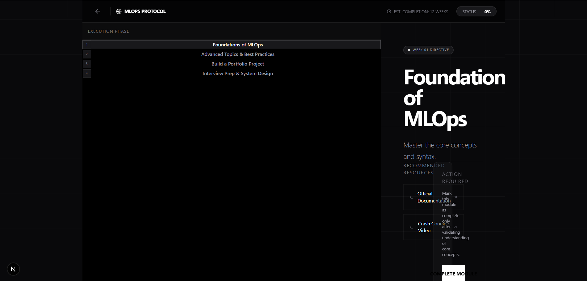

# PathOS: Agentic AI Career Co-Pilot

**PathOS** is an autonomous agentic system designed to optimize career trajectories. It reverse-engineers high-paying roles into granular, week-by-week execution protocols, tailored to your specific skills and bandwidth.



## 🚀 Key Features

*   **AI Roadmap Generation**: Generates detailed, week-by-week learning paths using **OpenRouter (Xiaomi MiMo-V2-Flash)**.
*   **Context Intelligence**: Analyzes user constraints (hours/week, current skills) to calculate optimal velocity.
*   **Resource Enrichment**: Automatically finds and attaches real, high-quality learning resources (Documentation, Videos, GitHub Repos) to every roadmap step.
*   **Simulation Mode**: Fully functional fallback system that operates without external API keys or Database connections, ensuring zero downtime for demos.
*   **Dual-Stack Architecture**: Modern Next.js 16 (React 19) frontend coupled with a robust FastAPI backend.

## 🛠️ System Architecture

The project is structured as a monorepo with distinct separation of concerns:

```
become-rich-by-2027/
├── backend/             # FastAPI Service
│   ├── main.py          # API Entry & Core Logic
│   ├── database.py      # MongoDB/Mock Persistence
│   └── venv/            # Python Virtual Environment
└── frontend/            # Next.js Application
    ├── app/             # App Router (Pages)
    └── components/      # UI Components (shadcn/ui)
```

## ⚡ Quick Start

### Prerequisites

*   Node.js 18+
*   Python 3.10+
*   (Optional) MongoDB Connection String
*   (Optional) OpenRouter API Key

### 1. Backend Setup (FastAPI)

The backend powers the AI logic and data persistence.

```bash
cd backend

# Create and activate virtual environment
python -m venv venv
# Windows:
.\venv\Scripts\activate
# Mac/Linux:
source venv/bin/activate

# Install dependencies
pip install -r requirements.txt

# Start the server
uvicorn main:app --reload --port 8000
```

> **Note:** The backend automatically enters **Simulation Mode** if no API keys are found. It uses in-memory storage and mock AI responses, so you can test the entire UI flow immediately.

### 2. Frontend Setup (Next.js)

The frontend provides the "hacker-aesthetic" command interface.

```bash
cd frontend

# Install dependencies
npm install

# Start the development server
npm run dev
```

Open [http://localhost:3000](http://localhost:3000) to initiate the protocol.

## 🔧 Configuration (.env)

Create a `.env` file in the `backend/` directory to enable full functionality:

```ini
# backend/.env

# AI Model Provider (OpenRouter)
OPENROUTER_API_KEY=sk-or-v1-... 

# Database (MongoDB Atlas)
MONGODB_URL=mongodb+srv://...

# Security
SECRET_KEY=your_secret_key
ALGORITHM=HS256
```

## 🧪 Simulation Mode

The system is built for resilience. If external services fail, Career_OS degrades gracefully:

1.  **Missing DB**: Automatically switches to in-memory `MOCK_USERS` and `MOCK_ROADMAPS`.
2.  **Missing API Key**: Generates a high-fidelity "Simulated Roadmap" with pre-calculated steps and hardcoded, high-value resource links.
3.  **Search Failure**: If the resource link search fails, the frontend renders a fallback "Search on Google" smart link.

## 📜 API Endpoints

*   `POST /register` & `/login`: JWT Authentication (Mock or Real).
*   `POST /generate-roadmap`: Triggers the AI agent to build a custom protocol.
    *   *Input*: Role, Salary Goal, Timeline, Skills, Bandwidth.
    *   *Output*: JSON Roadmap with enriched Resource objects.
*   `GET /roadmap`: Retrieves the active protocol.
*   `PUT /roadmap/progress`: Updates completion status.

## 🤝 Contributing

1.  Fork the repository.
2.  Create a feature branch (`git checkout -b feature/module-x`).
3.  Commit your changes (`git commit -m 'Add Module X'`).
4.  Push to the branch (`git push origin feature/module-x`).
5.  Open a Pull Request.

---

*"Stop guessing. Execute."*
